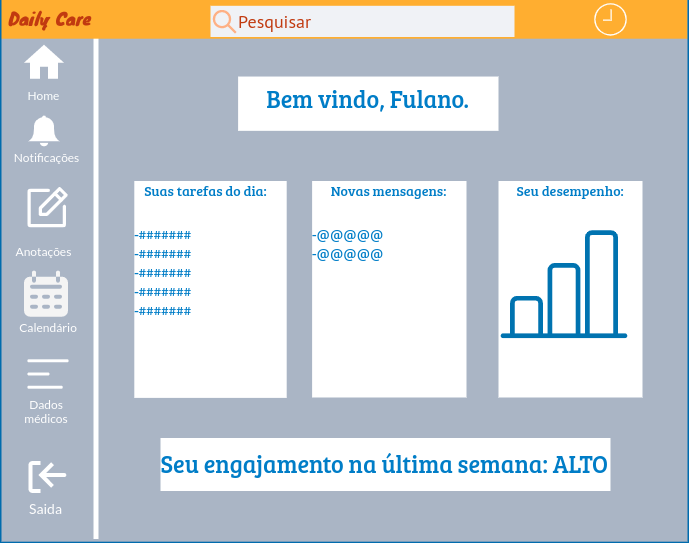

# Projeto de Interface

## User Flow

Fluxo de usuário (User Flow) é uma técnica que permite ao desenvolvedor mapear todo fluxo de telas do site ou app. Essa técnica funciona para alinhar os caminhos e as possíveis ações que o usuário pode fazer junto com os membros de sua equipe.

> **Links Úteis**:
> - [User Flow: O Quê É e Como Fazer?](https://medium.com/7bits/fluxo-de-usu%C3%A1rio-user-flow-o-que-%C3%A9-como-fazer-79d965872534)
> - [User Flow vs Site Maps](http://designr.com.br/sitemap-e-user-flow-quais-as-diferencas-e-quando-usar-cada-um/)
> - [Top 25 User Flow Tools & Templates for Smooth](https://www.mockplus.com/blog/post/user-flow-tools)

## Wireframes

Assim como apresentado através do fluxograma de páginas na seção User Flow, as telas do programa podem ser "divididas" em 3 seções.

> - Cabeçalho: Local onde são dispostos o logo da marca, barra de pesquisa e uma aplicação adicional.
> - Barra lateral: Apresenta os elementos de navegação para as funcionalidades.
> - Conteúdo: Apresenta o conteúdo da tela em questão.

## Tela-Login

A tela de login será a tela onde o usuário irá se identificar através de Usuário e Senha para usufruir das funcionalidades do Daily Care.

## Tela-Homepage

A tela de homepage apresenta as principais funcionalidades à disposição do usuário, entre elas: notificações; anotações; calendário; dados médicos. Assim como os ícones clicáveis das funcionalidades, a homepage também mostrará informações úteis como o engajamento do usuário, as tarefas a serem realizadas no dia, novas mensagens e o desempenho do usuário no cumprimento de suas tarefas.
A tela de homepage é dividida em 3 seções:

> - Onde se encontra uma barra de pesquisa onde o usuário poderá digitar palavras-chave no intuito de encontrar algo no dispositivo de gerenciamneto pessoal; um ícone de relógio, o qual servirá como um dispositivo de controle de horas dormidas.
> - Onde se encontram os ícones clicáveis das funcionalidades.
> - Onde se encontra as informações relevantes mais recentes tais como: tarefas a serem realizadas no dia; novas mensagens; desempenho; engajamento do usuário.

 
